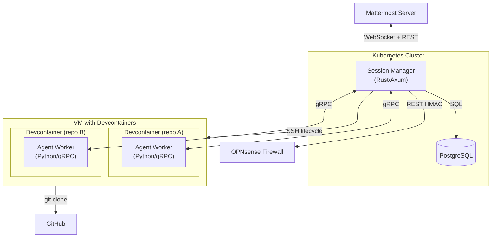

# Architecture Overview

Claude Session Manager is a polyglot (Rust + Python) Mattermost integration that enables interactive Claude Code sessions within Mattermost threads. The Rust gateway handles chat, container lifecycle, and routing. A Python Agent SDK worker inside each devcontainer handles AI execution via gRPC.

## System Architecture

```
Session Manager (Rust/K8s)              VM with Devcontainers
┌─────────────────────────┐            ┌──────────────────────────┐
│ • Mattermost WebSocket  │            │  Devcontainer (repo X)   │
│ • Command routing       │   gRPC     │  ┌────────────────────┐  │
│ • Container lifecycle   │◄══════════►│  │ Agent SDK Worker   │  │
│ • Database tracking     │  (tonic)   │  │ (Python)           │  │
│ • Container registry    │            │  │ • ClaudeSDKClient  │  │
│ • Prometheus metrics    │            │  │ • Session resume   │  │
│                         │            │  │ • Subagents        │  │
│ tonic gRPC client       │            │  │ • grpcio server    │  │
│ per devcontainer        │            │  └────────────────────┘  │
└─────────────────────────┘            │  + CLAUDE.md, .claude/   │
                                       │  + Same plugins/tools    │
                                       └──────────────────────────┘
```

**Execution path** (2 hops): Mattermost → Rust gateway → gRPC → Python Agent SDK worker

## System Components

### Repo Structure

```
claude-session-manager/
├── crates/                          ← Rust workspace
│   ├── session-manager/             ← Main gateway application (~5,800 lines)
│   ├── mattermost-client/           ← Mattermost WebSocket + REST (~600 lines)
│   ├── common/                      ← Shared crypto, rate limiting (~500 lines)
│   ├── graph-client/                ← Microsoft Graph (stub)
│   └── mail-bridge/                 ← Email bridge (stub)
├── packages/                        ← Python packages
│   └── agent-worker/                ← gRPC Agent SDK worker (~800 lines)
├── proto/                           ← Shared protobuf definitions
│   └── agent.proto
├── sql/                             ← Database schema bootstrapping
│   └── init.sql
├── pyproject.toml                   ← uv workspace root (pytest/ruff config)
├── Dockerfile.session-manager       ← Production multi-stage build
├── Dockerfile.session-manager.ci    ← CI image (pre-built binary)
├── .env.example                     ← All SM_* environment variables
└── .github/workflows/               ← CI/CD for both languages
    ├── build-session-manager.yml
    ├── release-session-manager.yml
    ├── build-agent-worker.yml
    ├── release-agent-worker.yml
    └── cleanup.yml
```

### Crate Structure (Rust)

| Crate | Purpose | Lines |
|-------|---------|-------|
| **session-manager** | Main application: HTTP server, session lifecycle, gRPC client | ~5,800 |
| **mattermost-client** | WebSocket listener + HTTP REST API client for Mattermost | ~600 |
| **common** | Shared utilities: HMAC-SHA256 crypto, rate limiting middleware | ~500 |
| **graph-client** | Microsoft Graph API client (stub, future use) | ~1 |
| **mail-bridge** | Email integration bridge (stub, future use) | ~3 |

### Python Packages

| Package | Purpose | Lines |
|---------|---------|-------|
| **agent-worker** | gRPC server wrapping Claude Agent SDK, session management, event mapping | ~800 |

### Core Modules (session-manager)

| Module | File | Lines | Responsibility |
|--------|------|-------|----------------|
| **HTTP Server & Router** | `main.rs` | 1,650 | Axum server, Mattermost command routing, stream output batching, Prometheus metrics |
| **Session Lifecycle** | `container.rs` | 602 | Session creation/teardown, gRPC connection per container, message_processor task |
| **Database** | `database.rs` | 691 | PostgreSQL ORM via sqlx: sessions, containers, pending requests, audit logs |
| **Git Operations** | `git.rs` | 454 | Repo cloning, worktree management, `RepoRef` parsing (`org/repo@branch`) |
| **Container Registry** | `container_registry.rs` | 409 | In-memory `RwLock<HashMap>` of running containers, keyed by `(repo, branch)` |
| **gRPC Client** | `grpc.rs` | 305 | tonic client mapping `AgentEvent` stream → `OutputEvent` enum |
| **Devcontainer** | `devcontainer.rs` | 299 | devcontainer.json parsing (JSONC), auto-generation with gRPC worker config |
| **Idle Monitor** | `idle_monitor.rs` | 272 | Periodic container teardown when no active sessions |
| **Liveness Monitor** | `liveness.rs` | 263 | Per-session activity tracking via DashMap, stale session warnings |
| **Output Events** | `stream_json.rs` | 180 | `OutputEvent` enum, tool action formatting, signal name mapping |
| **Configuration** | `config.rs` | 161 | `SM_`-prefixed env vars via `config` crate, `OnceLock` singleton |
| **SSH Executor** | `ssh.rs` | 152 | Remote command execution on VM for container lifecycle (devcontainer up/down) |
| **OPNsense Client** | `opnsense.rs` | — | Firewall REST API: domain alias management, validation |

### Agent Worker Modules (Python)

| Module | File | Lines | Responsibility |
|--------|------|-------|----------------|
| **gRPC Server** | `server.py` | 177 | `AgentWorkerServicer` implementing Execute, SendMessage, Interrupt, Health RPCs |
| **Event Mapper** | `event_mapper.py` | 136 | Maps SDK message types → protobuf `AgentEvent` messages |
| **Session Manager** | `session_manager.py` | 83 | Manages `ClaudeSDKClient` instances keyed by session_id |

### External Integrations

| System | Protocol | Purpose |
|--------|----------|---------|
| **PostgreSQL** | SQL (sqlx) | Persistent state: sessions, containers, pending requests, audit logs |
| **Mattermost** | WebSocket + HTTP REST | Message ingestion, thread replies, channel management, interactive buttons |
| **Agent Worker** | gRPC (tonic ↔ grpcio) | AI execution via Claude Agent SDK inside devcontainers |
| **OPNsense Firewall** | HTTP REST (HMAC-signed) | Dynamic domain allowlisting for container network access |
| **VM** | SSH | Container lifecycle: devcontainer up/down, git clone |
| **Git (GitHub)** | SSH (via VM) | Repository cloning, worktree creation/deletion |
| **Docker/Podman** | Via devcontainer CLI | Container runtime for development environments |
| **Prometheus** | HTTP (`/metrics`) | Metrics export: session counts, token usage, request latencies |

## gRPC Service Definition

The `proto/agent.proto` defines the communication contract between the Rust gateway and Python worker:

| RPC | Direction | Purpose |
|-----|-----------|---------|
| **Execute** | Gateway → Worker (server stream) | Start new session, stream `AgentEvent`s back |
| **SendMessage** | Gateway → Worker (server stream) | Continue existing session, stream response events |
| **Interrupt** | Gateway → Worker (unary) | Interrupt a running session |
| **Health** | Gateway → Worker (unary) | Check worker readiness after container start |

### AgentEvent Types

| Event | Maps to OutputEvent | Purpose |
|-------|---------------------|---------|
| `SessionInit` | _(captured internally)_ | Provides session_id for follow-up messages |
| `TextContent` | `TextLine` | Response text from Claude |
| `ToolUse` | `ToolAction` | Tool invocation (Read, Bash, Edit, etc.) |
| `ToolResult` | _(not surfaced)_ | Tool execution result (informational) |
| `SubagentEvent` | _(logged)_ | Subagent start/finish (native SDK feature) |
| `SessionResult` | `ResponseComplete` / `ProcessDied` | Final result with token usage |
| `AgentError` | `ProcessDied` | Error with type and message |

## Data Flow

### Message Lifecycle

```
Mattermost WebSocket
    │
    ▼
Message Handler (main.rs)
    │
    ├── Command (@claude start/stop/etc) ──► Process immediately
    │
    └── Regular message in thread ──► Session message_tx channel
                                          │
                                          ▼
                                    message_processor (container.rs)
                                          │
                                    ┌─────┴─────┐
                                    │ First msg  │ Follow-up
                                    ▼            ▼
                              gRPC Execute  gRPC SendMessage
                                    │            │
                                    └─────┬──────┘
                                          ▼
                                    AgentEvent stream (grpc.rs)
                                          │
                                          ▼
                                    OutputEvent channel
                                          │
                                          ▼
                                    stream_output() batching (main.rs)
                                          │
                                    ┌─────┴─────┐
                                    │           │
                                    ▼           ▼
                              Mattermost   Network Request
                              thread reply  Detection
```

### Session Startup

```
@claude start org/repo@branch
    │
    ▼
RepoRef::parse()
    │
    ▼
GitManager::clone_or_get_repo()  ──► SSH clone to /repos/github.com/org/repo
    │                                 (+ optional worktree)
    ▼
ContainerRegistry::lookup(repo, branch)
    │
    ├── Hit: reuse existing container (fast path, <5s)
    │
    └── Miss: cold_start()
          │
          ├── devcontainer up (via SSH)
          ├── wait_for_health() ──► gRPC Health RPC (30 retries, 1s interval)
          └── Register container in registry + PostgreSQL
               │
               ▼
    Session::create_internal()
        ├── Allocate mpsc channels (message_tx, output_tx)
        ├── Spawn message_processor (connects GrpcExecutor)
        ├── Register in liveness tracker
        ├── Auto-follow Mattermost thread for session creator
        └── Persist to PostgreSQL
```

### Network Approval Workflow

```
Claude outputs [NETWORK_REQUEST: pypi.org]
    │
    ▼
stream_output() regex detection
    │
    ▼
Validate domain (no wildcards, IPs, special chars)
    │
    ▼
Create PendingRequest in database
    │
    ▼
Post interactive message (Approve/Deny buttons with HMAC signatures)
    │
    ├── User clicks Approve ──► Verify HMAC → OPNsense add domain → Audit log
    │
    └── User clicks Deny ──► Audit log
```

### Multi-Agent Orchestration

Subagents are handled natively by the Claude Agent SDK within each devcontainer:

- Defined via `.claude/agents/*.md` files in the repo
- Invoked automatically by Claude via the Task tool
- Run in the same devcontainer with context isolation
- Worker reports `SubagentEvent` (start/finish) — gateway logs but does not intercept

Cross-repo orchestration (future): custom MCP tools in the worker that call back to the gateway API.

## Commands

### Top-Level Commands (any channel)

| Command | Description |
|---------|-------------|
| `start org/repo[@branch]` | Start a new session in a devcontainer |
| `start --plan org/repo` | Start in plan mode (plan permission set) |
| `start --worktree org/repo` | Start with isolated worktree |
| `orchestrate org/repo` | Start an orchestrator session |
| `stop` | Stop current session in thread |
| `status` | Show all running containers and sessions |
| `help` | Show available commands |

### In-Thread Commands (within a session thread)

| Command | Description |
|---------|-------------|
| `stop` | Stop this session |
| `stop --container` | Stop session and tear down container |
| `stop --all` | Stop all sessions on this container |
| `compact` | Compact session context |
| `clear` | Clear session and start fresh |
| `restart` | Restart session from scratch |
| `plan` | Toggle plan mode on/off |
| `title` | Capture next response as thread title |
| `context` | Show session context (last active, tokens, etc.) |

## Database Schema

5 tables managed via `database.rs` with auto-initialization. Bootstrap with `sql/init.sql`.

| Table | Purpose | Key Fields |
|-------|---------|------------|
| **sessions** | Track active/historic sessions | `session_id`, `channel_id`, `thread_id`, `project`, `container_name`, `session_type` |
| **containers** | Track devcontainer lifecycle | `repo` + `branch` (unique), `container_name`, `state` (running/stopping/stopped), `session_count` |
| **project_channels** | Map projects to Mattermost channels | `project` (PK), `channel_id`, `channel_name` |
| **pending_requests** | Network approval queue | `request_id`, `session_id`, `domain`, `post_id` |
| **audit_logs** | Approval/denial audit trail | `request_id`, `domain`, `action`, `approved_by` |

## Session Types

| Type | Purpose | Worktree |
|------|---------|----------|
| **standard** | Interactive user session | Shared repo |
| **orchestrator** | Multi-agent coordinator using SDK subagents | Shared repo |
| **worker** | Task executor, created via `start --worktree` | Isolated worktree |
| **reviewer** | Code review session, created via `start --worktree` | Isolated worktree |

## Background Tasks

5 concurrent Tokio tasks with `CancellationToken` for graceful shutdown (10s timeout):

1. **WebSocket Listener** - Mattermost message ingestion with exponential backoff reconnection (1s → 60s)
2. **Message Handler** - Command parsing and session routing (mpsc channel consumer)
3. **Stream Output** - Per-session `OutputEvent` batching, network request detection, Mattermost posting
4. **Liveness Monitor** - Periodic stale session detection and warning (default: 120s timeout)
5. **Idle Monitor** - Periodic container teardown when session_count=0 (default: 1800s timeout)

## Observability

### Prometheus Metrics

Exposed at `GET /metrics`:

| Metric | Type | Description |
|--------|------|-------------|
| `sessions_started_total` | Counter | Total sessions started |
| `active_sessions` | Gauge | Currently active sessions |
| `session_start_duration_seconds` | Histogram | Time to start a session |
| `tokens_input_total` | Counter | Total input tokens consumed |
| `tokens_output_total` | Counter | Total output tokens consumed |
| `network_requests_total` | Counter | Network approval requests created |
| `network_requests_deduplicated_total` | Counter | Duplicate network requests suppressed |
| `network_request_duration_seconds` | Histogram | Time to process network requests |
| `approvals_total` | Counter | Approval/denial actions (labeled by `action`) |
| `callback_duration_seconds` | Histogram | Callback endpoint processing time |

### Health Check

`GET /health` returns 200 when the server is ready. Used by Docker `HEALTHCHECK` and Kubernetes probes.

## Security Architecture

| Layer | Implementation |
|-------|----------------|
| **Callback Integrity** | HMAC-SHA256 with length-prefixed format preventing collision attacks |
| **Domain Validation** | Reject wildcards, IPs, special chars; require dots; no leading/trailing dots or hyphens |
| **Path Traversal Prevention** | Worktree names validated to `[a-zA-Z0-9_.-]` only |
| **SQL Injection** | Parameterized queries throughout via sqlx |
| **Shell Injection** | All user inputs escaped via `shell_escape` crate before SSH execution |
| **Rate Limiting** | Per-IP token bucket on all HTTP endpoints (configurable rps + burst) |
| **Approver Control** | Optional `SM_ALLOWED_APPROVERS` restricts network approval permissions |
| **Audit Trail** | All approve/deny actions logged with user, domain, timestamp |
| **Network Isolation** | Containers have no internet by default; OPNsense firewall controls per-domain access |
| **Container Isolation** | Each repo runs in its own devcontainer; worker process sandboxed inside |

## Deployment

### Production

- **Dockerfile.session-manager**: Multi-stage Rust build (`rust:1.93-slim` → `debian:trixie-slim`)
- Requires `protobuf-compiler` at build time for tonic-build
- Runtime needs: `ca-certificates`, `openssh-client`, `curl`
- Exposes port 8000 with 30s health check interval
- Agent worker installed in devcontainer base images via `pip install agent-worker`

### CI/CD

| Workflow | Trigger | Purpose |
|----------|---------|---------|
| `build-session-manager.yml` | `workflow_dispatch` | Rust CI via `rust-pipeline.yml@v1` |
| `release-session-manager.yml` | Tag `session-manager/v*` | Rust release + Docker publish via `rust-pipeline.yml@v1` |
| `build-agent-worker.yml` | `workflow_dispatch` | Python CI via `python-pipeline.yml@v1` |
| `release-agent-worker.yml` | Tag `agent-worker/v*` | Python release + wheel publish via `python-pipeline.yml@v1` |
| `cleanup.yml` | Weekly (Sunday) | Clean old container images |

All CI/CD uses reusable workflows from `jcttech/.github` running on self-hosted ARC runners.

### Versioning

- Rust: `session-manager/v*` tags (current: `session-manager/v1.0.0`)
- Python: `agent-worker/v*` tags (hatch-vcs extracts version from tag)

## Technology Stack

- **Language**: Rust (2021 edition) + Python 3.13
- **Async Runtime**: Tokio (Rust), asyncio (Python)
- **Web Framework**: Axum 0.8
- **gRPC**: tonic 0.12 / prost 0.13 (Rust), grpcio (Python)
- **AI Engine**: Claude Agent SDK (`claude-agent-sdk` via Python worker)
- **Database**: PostgreSQL (sqlx with runtime-tokio)
- **Serialization**: serde / serde_json (Rust), protobuf (cross-language)
- **HTTP Client**: reqwest
- **WebSocket**: tokio-tungstenite (via mattermost-client)
- **Container Runtime**: Docker/Podman via devcontainer CLI
- **Observability**: metrics + metrics-exporter-prometheus
- **Python Tooling**: uv, hatch-vcs

## Configuration

All settings use `SM_` environment variable prefix, loaded via `OnceLock` singleton. See `.env.example` for full list.

**Required** (9): `MATTERMOST_URL`, `MATTERMOST_TOKEN`, `MATTERMOST_TEAM_ID`, `VM_HOST`, `OPNSENSE_URL`, `OPNSENSE_KEY`, `OPNSENSE_SECRET`, `CALLBACK_SECRET`, `DATABASE_URL`

**Optional** (20+): VM user/port, container idle timeout, liveness timeout, rate limit params, repos base path, firewall alias name, server bind address, `GRPC_PORT_START` (default: 50051), etc.

## Test Coverage

| Suite | Count | Location |
|-------|-------|----------|
| common unit tests | 26 | `crates/common/src/` |
| session-manager unit tests | 83 | `crates/session-manager/src/` |
| database integration tests | 17 | `crates/session-manager/tests/database_tests.rs` |
| integration tests | 64 | `crates/session-manager/tests/integration_tests.rs` |
| Python unit tests | 16 | `packages/agent-worker/tests/` |
| **Total** | **206** | |

## Diagrams



See `architecture.excalidraw` for detailed component diagrams.

---
_Last updated: 2026-02-21_
_Generated by /jcttech.architecture_
